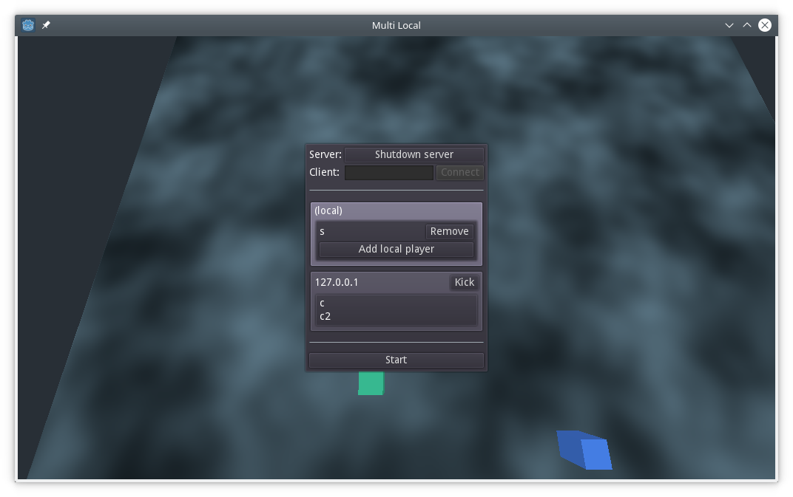
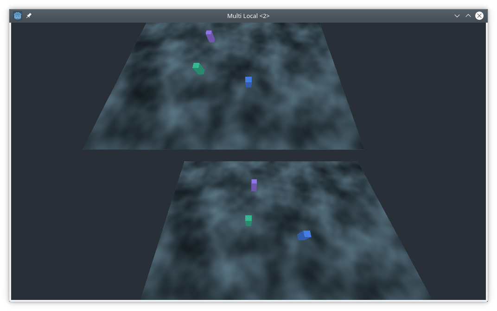

# Description

This is an example game with both local (splitscreen) and networked multiplayer. It allows multiple machines to play together, with multiple players per machine.

# Features

* Decoupled Character (game entity) from Player (which controls it)
  * Allows characters to be controlled in different ways, e.g. AI. Only the machine on which the player is has the Player object, on other machines the Character is puppeted directly.
* Multiple control schemes allowing multiple players to use the same keyboard
* Split-screen (multiple viewports) with cameras attached to Characters
* Networked multiplayer allowing clients to join servers, control characters there
* Initial sync allowing clients to join ongoing game and get the existing characters (also clients and players)
* UI for hosting, connecting, adding/removing local players, kicking clients (if server)
